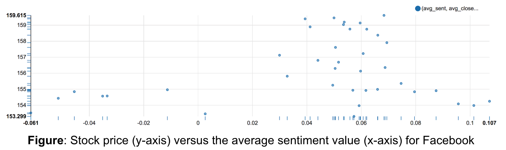

# Sentimento

Stock sentiment analysis project, correlate stock behaviors and tweet sentiments.

## Getting Started

This project only provides a single node deployment method guidance using `docker-compose`, users may also use bootstrap script to customize their own builds in cluster environments.

make sure you install Docker (version >= 18) and run the following command to bootstrap Sentimento in your computer:

```
docker-compose up
```

### System requirements

> System: Mac OSX (10.12.6) Sierra or higher \
> Storage: 16GB RAM, 100GB+ Disk space

Note: This project requires the machine to have at least 16GB of RAM and more than 100GB of disk storage to fully operate. If not so, the data is insufficient to provide a more accurate result.

### Development Setup

> Make sure for each module, use the specific Python version noted in `.python-version`

Follow the instructions on [this site](https://packaging.python.org/guides/installing-using-pip-and-virtualenv/) to install `pip` and `virtualenv`

Then, to start a new module development:

- `cd` to the module directory

- run `virtualenv venv` to create a new isolated environment

- activate your `venv` by `source ./bin/activate`, install any dependencies by `pip install <your dependency>`

- The directory of `venv` contains all libraries and binaries you will use under your module and it is not check into the source.

- before deactivation, run `pip freeze --local > requirements.txt` to dump module dependencies to `requirements.txt`

- deactivate your `venv` by `deactivate`, specify a `.python-version` file with your module's Python version

then you are done.

To work with existing modules:

- `cd` to the module directory

- install a Python version specified in `.python-version`

- run `virtualenv venv` to create a `venv`

- activate your `venv` and run `pip install -r requirements.txt` to install dependencies for that module

- deactivate as above

## Example insights

In Zeppelin dashboard, an example of a stock price movement versus the average sentiment values of relevant tweets, Facebook (symbol: FB) share has relative higher price with more positive sentiments while lower price with more negative sentiments.



## License

Copyright &copy; 2018, Sentimento is licensed under [MIT](https://opensource.org/licenses/MIT).